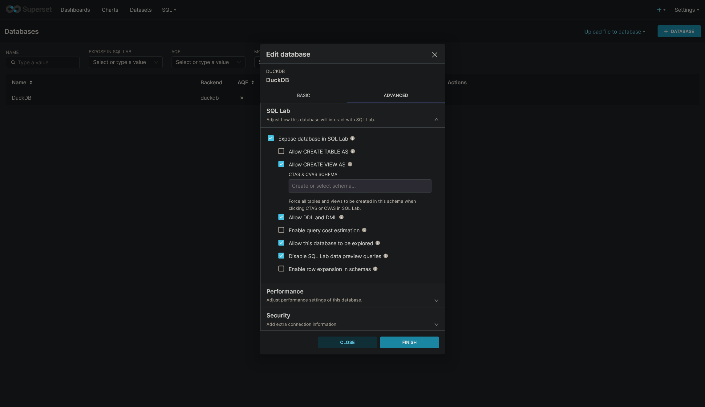

# Analytics/Data Engineering Playground

This repo is my playground for testing out analytics/data engineering tech and processes.

## Tech Stack

- [Python 3.12](https://docs.python.org/3.12/)
- [uv](https://docs.astral.sh/uv)
- [Dagster](https://docs.dagster.io)
- [Polars](https://docs.pola.rs)
- [DuckDB](https://duckdb.org/docs/stable/)
- [dbt](https://docs.getdbt.com/)
- [Superset](https://superset.apache.org/docs/intro)

## Local Setup

### Prerequisites

- [Mise](https://mise.jdx.dev/getting-started.html)
- [Docker](https://docker.com)

### Setup

1. Install the prerequisites.
2. Install tools:
    ```shell
    mise trust -y
    mise install -y
    ```
   This will install required tools & languages for the project. Refer to [.mise.toml](./.mise.toml) for the specifics.
3. Run initial [setup script](./Taskfile.yml#L8):
    ```shell
    task init
    ```
   This will install pre-commit, install the [pre-commit hooks](./.pre-commit-config.yaml), setup
   the [Python virtualenv](./pyproject.toml) for the project, and create a temporary data directory.
4. This project uses a self-hosted instance of [Infisical](https://infisical.com/) for secrets management. If you are
   using this repo as a template, you will likely be providing your own secrets, which can be read from a standard
   `.env`. Copy the contents of [.env.example](./.env.example) into a new file named `.env` and supply the values
   accordingly.
5. Run the [container launch script](./Taskfile.yml#L16):
    ```shell
    task
    ```
6. Access the Dagster UI at `http://localhost:3030`.

### Configuration

See [.env.example](./.env.example) for configurable environment variables.

| Name                | Description                                         |
|---------------------|-----------------------------------------------------|
| MINIO_ACCESS_KEY    | Access Key ID for MinIO/S3 bucket                   |
| MINIO_SECRET_KEY    | Secret Access Key for MinIO/S3 bucket               |
| MINIO_BUCKET        | MinIO/S3 bucket name to use for Dagster IO managers |
| MINIO_REGION        | MinIO/S3 bucket region                              |
| MINIO_ENDPOINT      | MinIO/S3 API endpoint                               |
| MINIO_ROOT_USER     | MinIO root user username                            |
| MINIO_ROOT_PASSWORD | MinIO root user password                            |
| NASA_FIRMS_MAP_KEY  | Map Key for access to NASA FIRMS data               |

### Cleanup

After finishing work on the project, free up resources by shutting down the containers:

```shell
task stop
```

## Data

### Sources

- [**NASA FIRMS Active Fire Data**](https://firms.modaps.eosdis.nasa.gov/)
  - Data is accessed on-demand through the API.
  - Requires `NASA_FIRMS_MAP_KEY` environment variable.
- [**Project CCHAIN**](https://www.kaggle.com/datasets/thinkdatasci/project-cchain)
  - Dataset has been cloned and is accessed from a self-hosted MinIO instance.
  - Requires `MINIO_*` environment variables.
  - This project expects the dataset CSVs to be located in a single directory named `project-cchain` in a bucket named
    `datasets`. This value is not configurable as of now, but can be changed in
    the [source](./src/internal/core.py#L19).

### Materializing local data lake

Select dataset CSVs are ingested, cleaned, standardized, and output as DuckDB tables on the local filesystem. Tables are
materialized via Dagster.

1. Open the Dagster UI at `http://localhost:3030`.
2. On the sidebar, navigate to the `cchain` asset group.
   
3. Click on **Materialize all**.
4. Wait for the run to complete successfully.

The datasets are now available in a local DuckDB file at `data/lake/db.duckdb`. To begin exploring the data, you can use
the DuckDB CLI, spin up a Jupyter notebook, or use Apache Superset.

#### DuckDB CLI

1. Open a DuckDB session
    ```shell
    duckdb
    ```
2. Load the local data lake
    ```shell
    .open data/lake/db.duckdb
    ```
3. Start querying the data
    ```sql
    SELECT *
    FROM ae_de_play.cchain__climate_atmosphere
    ORDER BY "date"
    LIMIT 50;
    ```

#### Jupyter Notebook

1. Start a Jupyter server
    ```shell
    uv run jupyter notebook
    ```
2. Open the Jupyter notebook UI at `http://localhost:8888`.
3. Open [scratch.ipynb](./scratch.ipynb), or create your own notebook.
4. Start querying the data
    ```python
    import duckdb

    conn = duckdb.connect("./data/lake/db.duckdb")
    conn.sql("""
    SELECT *
    FROM ae_de_play.cchain__climate_atmosphere
    ORDER BY date
    LIMIT 50;
    """).pl()  # Print the results as an interactive Polars dataframe
    ```

#### Apache Superset

1. Open the Superset UI at `http://localhost:8088`.
2. Login with `superset` as both the username and password.
3. Navigate to Settings (top-right) > Database Connections.
4. Click on **+ DATABASE**.
5. In the **Supported Databases** dropdown, select **DuckDB**.
6. Click on **Connect this database with a SQLAlchemy URI string instead** link at the bottom of the form.
7. Use `duckdb:////opt/data/lake/db.duckdb` as the **SQLAlchemy URI**.
8. Go to the **Advanced** tab.
9. Under **SQL Lab** section, ensure the following settings are checked:
   
10. Click on **Connect**.
11. Navigate to SQL > SQL Lab.
12. On the left sidebar, select **DuckDB** as the database, and **duck.public** as the schema.
13. Start querying the data.
